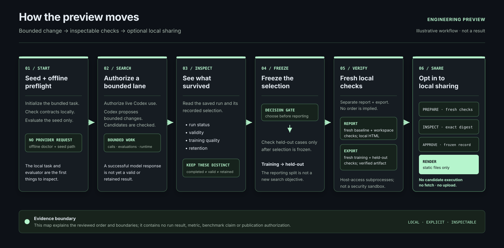

# How the preview moves

This diagram is an explanatory map of the LibreEvolve engineering preview. It
describes the order in which a person can inspect decisions and artifacts; it
is not a run trace, benchmark result, performance measurement, or publication
approval. The preview is bounded Python bin-packing optimization with Codex
OAuth, not arbitrary-repository optimization.

## Read the boundary from left to right

1. **Start with a seed and offline preflight.** Initialize the bundled task,
   check its evaluator and configuration locally, and exercise the seed-only
   path. These paths make no provider request.
2. **Authorize bounded search separately.** Live subscription-backed Codex use
   is an explicit choice. The run proposes bounded changes and evaluates
   candidates under local call, evaluation and runtime limits. A provider
   response is not evidence that a candidate is valid or retained.
3. **Inspect what survived.** Read the saved run’s status, validity, training
   quality and retention as separate dimensions. A completed run can lack a
   valid or archive-retained improvement.
4. **Freeze selection before held-out reporting.** Choose the candidate to
   report before using the separate held-out split. Those cases are a reporting
   view after selection, not a new search objective.
5. **Run fresh local checks before using an artifact.** `alpha report` and
   `alpha export` are separate authorities. A report freshly checks the
   baseline and on-disk workspace; export freshly verifies the selected
   single-file candidate on named training and held-out cases and writes a new
   local artifact. The diagram intentionally does not claim that either
   command depends on the other.
6. **Share only through a separately reviewed local boundary.** Preparation
   resolves a saved candidate and performs fresh local checks; inspection
   validates a frozen allowlisted record and its exact digest; approval is an
   explicit operator choice. Rendering the approved record writes deterministic
   static files only: it does not execute candidate code, fetch resources or
   upload anything. Sharing is not deployment, authentication or a live-model
   demonstration.

The fresh checks execute candidate Python in timed host-access subprocesses.
That is an execution boundary, not a hostile-code security sandbox. Hashes
identify bytes; they are not signatures, independent attestations, universal
correctness proofs or optimality proofs. Missing usage is unknown, not zero
cost.

## Source and provenance

The SVG is hand-authored deterministic documentation: no external images,
fonts, scripts, generated metrics or run data are embedded. Its labels and
boundaries are derived from these maintained sources:

| Source | What the diagram uses |
| --- | --- |
| [`site/content/how-it-works.md`](../../site/content/how-it-works.md) | The public narrative: seed, authorized search, inspection, frozen held-out reporting, fresh checks and separate sharing. |
| [`docs/alpha-quickstart.md`](../alpha-quickstart.md) | Offline preflight, seed-only execution and the optional live Codex route. |
| [`docs/results.md`](../results.md) | Separate run status, validity, training/held-out quality, retention, usage and export authority. |
| [`docs/share-export.md`](../share-export.md) | Prepare/inspect/render separation, explicit approval, local-only output and the no-execute/no-fetch/no-upload render boundary. |
| [`libreevolve/alpha.py`](../../libreevolve/alpha.py) | The CLI command boundaries for `init`, `doctor`, `report`, `export` and `share`. |
| [`libreevolve/cli.py`](../../libreevolve/cli.py) | The top-level `run` command. |
| [`libreevolve/core/loop.py`](../../libreevolve/core/loop.py) | Seed evaluation followed by the bounded candidate loop. |
| [`libreevolve/core/run_inspection.py`](../../libreevolve/core/run_inspection.py) | Saved-run inspection and archive-retained selection semantics. |
| [`libreevolve/problems/examples/bin_packing/validate.py`](../../libreevolve/problems/examples/bin_packing/validate.py) | Training evaluation and the separate `evaluate_holdout` reporting entry point. |
| [`libreevolve/alpha_report.py`](../../libreevolve/alpha_report.py) | Fresh report verification and the selected-candidate verification used by export. |
| [`libreevolve/alpha_share_prepare.py`](../../libreevolve/alpha_share_prepare.py) | Fresh local preparation of an unapproved proposal. |
| [`libreevolve/alpha_share_record.py`](../../libreevolve/alpha_share_record.py), [`libreevolve/alpha_share_render.py`](../../libreevolve/alpha_share_render.py) and [`libreevolve/alpha_share_io.py`](../../libreevolve/alpha_share_io.py) | Frozen record validation, exact-payload approval, deterministic rendering and the fixed public-file boundary. |

The workflow image should therefore be read beside the source documents, not
as a substitute for their command details, limitations or evidence records.
